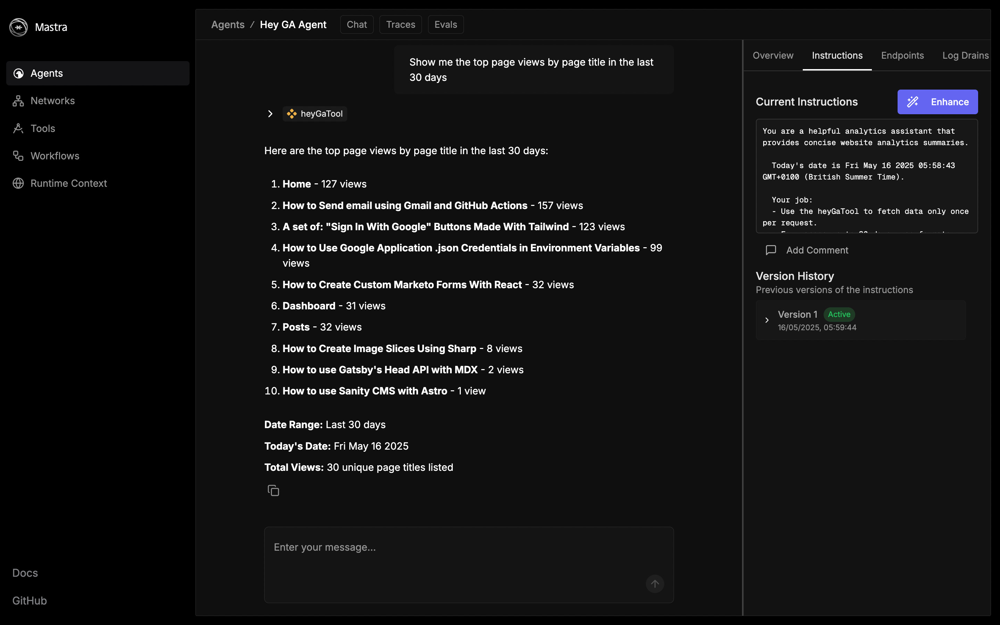

# 👋 hey-ga

Google Analytics Agent | A [Mastra Hackathon](https://mastra.ai/hackathon) project. Submit your Agent [here](https://docs.google.com/forms/d/e/1FAIpQLSc5_s9okeyicUJqQGmDofn_Mz6teAIDuyAz7o94gqAlYZCEeQ/viewform).

This Agent can be used to query Google Analytics data using natural language, for example:

> Show me the top page views by page title in the last 30 days
> <br/>
> Where in the world have my visitors come from in the last 30 days?
> <br />
> What referrers have driven traffic to my site in the last 30 days?

The agent will ask follow-up questions to better understand your request, then provide a helpful list of answers.



## Getting started

This project uses OpenAI [gpt-4o-mini](https://platform.openai.com/docs/models/gpt-4o-mini) and the [Google Analytics Data: Node.js Client](https://www.npmjs.com/package/@google-analytics/data).

### Setup

You'll need x3 environment variables to use this Agent.

1. `OPENAI_API_KEY`
2. `GA4_PROPERTY_ID`
3. `GOOGLE_APPLICATION_CREDENTIALS_BASE64`

Start by running the below, then add you API and property keys:

```bash
cp .env.example .env.development
```

## Google Credentials

Setting up and then using Google Credentials is, in my opinion, harder than it needs to be. To help you out, I’ve written two blog posts that should guide you through the process.

1. [Creating a Google Cloud Project | Smashing Magazine](https://www.smashingmagazine.com/2024/09/how-create-weekly-google-analytics-report-posts-slack/#creating-a-google-cloud-project)
2. [How to Use Google Application .json Credentials in Environment Variables | paulie.dev](https://www.paulie.dev/posts/2024/06/how-to-use-google-application-json-credentials-in-environment-variables/)

### Local Development

With environment variables in place, install the dependencies:

```bash
npm install
```

Run the dev server:

```bash
npm run dev
```

Visit the Mastra Playground in your browser:

- [http://localhost:4111/](http://localhost:4111)
